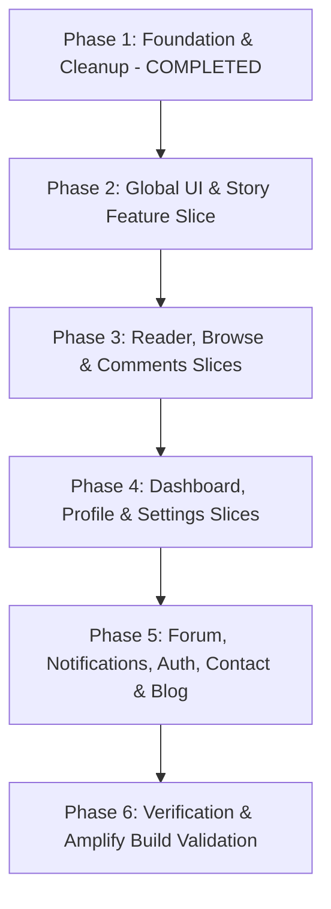

# FableSpace (`fiction-app`) Feature-Based Architecture & Refactoring Master Plan

> **Objective**: Transform `fiction-app` into a modular, production-grade, highly maintainable Next.js (App Router) codebase using **Feature-Driven (Vertical Slice) Architecture**, fully optimized for AWS Amplify deployment.

---

## 🏛️ 1. Architectural Architecture & Folder Standards

### 1.1 Architecture Principle: Vertical Feature Slices
Instead of scattering components, hooks, types, and API clients across distant global folders, every domain is encapsulated inside its own feature module under `src/features/<feature-name>/`.

```
src/
├── features/                     # 🚀 Domain Feature Slices (Self-contained)
│   ├── home/                     # Homepage hero, curated sections, CTA banners
│   ├── story/                    # Story cards, metadata, details, ratings, recommendations
│   ├── reader/                   # Chapter reading content, settings, navigation, progress
│   ├── browse/                   # Catalog search, filter bar, genre/status selectors
│   ├── comments/                 # Comment list, comment items, reply tree, reaction inputs
│   ├── dashboard/                # Author analytics, overview/stories/earnings tabs, charts
│   ├── settings/                 # Profile, account, monetization, notification settings
│   ├── forum/                    # Community discussions, rich-text editor, forum rules
│   ├── library/                  # User library, bookmarks, reading history
│   ├── user-profile/             # Public profile, author works, followers/following modals
│   ├── notifications/            # Notification list, item renderer, status badge
│   ├── auth/                     # Login, signup, password reset, OAuth, verification
│   └── contact/                  # Contact form & feedback
│
├── components/                   # 🌐 ONLY Truly Shared Global UI
│   ├── ui/                       # Pure shadcn / Radix design tokens & primitives
│   ├── layout/                   # Global app chrome (Navbar, SiteFooter, BottomNav, UserAvatarMenu)
│   └── common/                   # Global shared widgets (AdBanner, OfflineBanner, MarkdownRenderer, SocialIcons, LegalPageLayout)
│
├── hooks/                        # 🪝 Cross-cutting generic hooks only (use-debounce, use-mobile, use-media-query)
├── types/                        # 📦 Global types only (User, Session, Pagination, ApiResponse)
├── lib/                          # 🛠️ Global utilities, apiClient instance, error handling, validation base
├── contexts/                     # 🔄 Global React context providers (AuthContext, NotificationContext)
├── constants/                    # 📌 App-wide constants (genres, languages, licenses)
├── styles/                       # 🎨 Global styles & Tailwind configuration
└── app/                          # ⚡ Next.js App Router (Thin route orchestrators importing from features)
```

---

### 1.2 Anatomy of a Feature Slice (`src/features/<feature>/`)

Each feature encapsulates its own internal concerns and exposes a clean public interface via `index.ts`:

```
src/features/story/
├── components/                   # Feature-specific UI components
│   ├── story-card/               # Modular card variants (portrait, landscape, mini, featured)
│   ├── story-header.tsx
│   ├── story-tabs.tsx
│   ├── story-actions-bar.tsx
│   └── story-rating-dialog.tsx
├── hooks/                        # Feature-specific hooks (e.g. use-story-details, use-story-actions)
├── api/                          # Feature-specific API calls (e.g. story-api.ts)
├── types/                        # Feature-specific TypeScript interfaces & DTOs
└── index.ts                      # Explicit public barrel export
```

#### The Public Boundary Rule (`index.ts`)
- Code outside `src/features/story` should ONLY import from `@/features/story`.
- Subcomponents or helper hooks not exported in `index.ts` remain internal to the feature, preventing unwanted tight coupling.

---

### 1.3 Shared vs Feature Placement Matrix

| Item Type | When it belongs in `src/components/` / `src/hooks/` | When it belongs in `src/features/<feature>/` |
| :--- | :--- | :--- |
| **Component** | Used across 3+ unrelated domains (e.g. `Navbar`, `AdBanner`, `Button`, `Dialog`) | Specific to 1 or 2 related workflows (e.g. `FilterBar`, `ChapterContent`, `EarningsChart`) |
| **Hook** | Generic utility (e.g. `useMobile`, `useDebounce`, `useMediaQuery`) | Encapsulates domain logic (e.g. `useComments`, `useReadingProgress`, `useDashboardStats`) |
| **Type** | Global model (e.g. `User`, `PaginatedResponse<T>`, `BaseEntity`) | Feature DTO (e.g. `StoryReview`, `EarningsBreakdown`, `ForumPostDraft`) |
| **API** | Core axios/fetch client instance (`apiClient.ts`) | Domain API functions (e.g. `storyApi.getDetails`, `commentApi.postReply`) |

---

## 📄 2. Page-by-Page Restructuring Plan (Feature Mapping)

---

### Module 1: Root & Global Layout (`/`)
- **Route**: `src/app/layout.tsx`, `src/app/providers.tsx`
- **Target Placement**:
  - `src/components/layout/navbar.tsx`
  - `src/components/layout/site-footer.tsx`
  - `src/components/layout/bottom-nav.tsx`
  - `src/components/layout/user-avatar-menu.tsx`
  - `src/components/layout/theme-provider.tsx`
- **Actions**:
  1. Relocate layout chrome from loose `src/components/` into `src/components/layout/`.
  2. Optimize `src/app/providers.tsx` to cleanly compose `AuthProvider`, `NotificationProvider`, and `ThemeProvider`.
  3. Clean up font variable injections in `layout.tsx`.

---

### Module 2: Home Page (`/`)
- **Route**: `src/app/page.tsx`
- **Target Placement**: `src/features/home/`
  ```
  src/features/home/
  ├── components/
  │   ├── hero-carousel.tsx
  │   ├── featured-stories-section.tsx
  │   ├── trending-genres-bar.tsx
  │   ├── new-arrivals-section.tsx
  │   ├── top-rated-section.tsx
  │   ├── most-viewed-section.tsx
  │   ├── continue-reading-section.tsx
  │   └── cta-author-banner.tsx
  ├── hooks/
  │   └── use-home-data.ts
  └── index.ts
  ```
- **Actions**:
  1. Decompose the 19.8 KB monolithic `src/app/page.tsx` into modular section components under `src/features/home/components/`.
  2. Keep `src/app/page.tsx` as a clean asynchronous Server Component coordinator.

---

### Module 3: Browse & Search Page (`/browse`)
- **Route**: `src/app/browse/page.tsx`
- **Target Placement**: `src/features/browse/`
  ```
  src/features/browse/
  ├── components/
  │   ├── browse-content.tsx
  │   ├── filter-bar/
  │   │   ├── filter-bar.tsx
  │   │   ├── genre-selector.tsx
  │   │   ├── status-sort-dropdown.tsx
  │   │   ├── tag-multi-select.tsx
  │   │   └── search-input.tsx
  │   ├── browse-story-grid.tsx
  │   └── browse-empty-state.tsx
  ├── hooks/
  │   └── use-browse-filters.ts
  ├── api/
  │   └── browse-api.ts
  ├── types/
  │   └── browse.types.ts
  └── index.ts
  ```
- **Actions**:
  1. Move `horizontal-filter-bar.tsx` (500+ lines) into `src/features/browse/components/filter-bar/` and split into micro-selectors.
  2. Encapsulate 12 query parameter state syncs into `useBrowseFilters()`.

---

### Module 4: Story Details Page (`/story/[slug]`)
- **Route**: `src/app/story/[slug]/page.tsx`
- **Target Placement**: `src/features/story/`
  ```
  src/features/story/
  ├── components/
  │   ├── story-card/
  │   │   ├── story-card.tsx
  │   │   ├── story-card-portrait.tsx
  │   │   ├── story-card-landscape.tsx
  │   │   ├── story-card-mini.tsx
  │   │   └── story-card-skeleton.tsx
  │   ├── story-header.tsx
  │   ├── story-actions-bar.tsx
  │   ├── story-tabs/
  │   │   ├── story-synopsis-tab.tsx
  │   │   ├── story-chapters-tab.tsx
  │   │   └── story-reviews-tab.tsx
  │   ├── story-support-dialog.tsx
  │   ├── story-rating-dialog.tsx
  │   └── story-recommendations.tsx
  ├── hooks/
  │   ├── use-story-details.ts
  │   └── use-story-actions.ts
  ├── api/
  │   └── story-api.ts
  ├── types/
  │   └── story.types.ts
  └── index.ts
  ```
- **Actions**:
  1. Decompose `story-page-client.tsx` (700+ lines) into clean tab and dialog subcomponents.
  2. Modularize `story-card.tsx` (745 lines) into variant files under `src/features/story/components/story-card/`.

---

### Module 5: Comments System (`/story/[slug]`, `/community`)
- **Target Placement**: `src/features/comments/`
  ```
  src/features/comments/
  ├── components/
  │   ├── comment-section.tsx
  │   ├── comment-list.tsx
  │   ├── comment-item.tsx
  │   ├── comment-form.tsx
  │   ├── comment-reply-tree.tsx
  │   ├── comment-edit-input.tsx
  │   └── comment-actions-menu.tsx
  ├── hooks/
  │   └── use-comments.ts
  ├── api/
  │   └── comment-api.ts
  ├── types/
  │   └── comment.types.ts
  └── index.ts
  ```
- **Actions**:
  1. Split `comment-section.tsx` (985-line god component) into 7 focused files (<150 lines each).
  2. Encapsulate comments pagination, reply trees, and mutations inside `useComments()`.

---

### Module 6: Chapter Reader (`/story/[slug]/chapter/[chapterNumber]`)
- **Route**: `src/app/story/[slug]/chapter/[chapterNumber]/page.tsx`
- **Target Placement**: `src/features/reader/`
  ```
  src/features/reader/
  ├── components/
  │   ├── chapter-page-client.tsx
  │   ├── chapter-content.tsx
  │   ├── chapter-header.tsx
  │   ├── chapter-navigation.tsx
  │   ├── top-navigation.tsx
  │   ├── engagement-section.tsx
  │   └── reader-settings-dialog.tsx
  ├── hooks/
  │   ├── use-reader-settings.ts
  │   └── use-reading-progress.ts
  ├── api/
  │   └── chapter-api.ts
  ├── types/
  │   └── chapter.types.ts
  ├── styles/
  │   └── reading.css
  └── index.ts
  ```
- **Actions**:
  1. Standardize all PascalCase filenames (`ChapterContent.tsx`, `TopNavigation.tsx`) to `kebab-case.tsx`.
  2. Extract font/theme preference state to `useReaderSettings()`.
  3. Extract scroll position saving and restore to `useReadingProgress()`.

---

### Module 7: Author Dashboard (`/dashboard`)
- **Route**: `src/app/dashboard/page.tsx`
- **Target Placement**: `src/features/dashboard/`
  ```
  src/features/dashboard/
  ├── components/
  │   ├── dashboard-header.tsx
  │   ├── dashboard-tabs.tsx
  │   ├── stats-card.tsx
  │   ├── tabs/
  │   │   ├── overview-tab.tsx
  │   │   ├── stories-tab.tsx
  │   │   └── earnings-tab.tsx
  │   └── charts/
  │       ├── views-chart.tsx
  │       └── earnings-breakdown-chart.tsx
  ├── hooks/
  │   ├── use-dashboard-data.ts
  │   ├── use-dashboard-stats.ts
  │   ├── use-dashboard-stories.ts
  │   └── use-earnings-data.ts
  ├── api/
  │   └── dashboard-api.ts
  ├── types/
  │   └── dashboard.types.ts
  └── index.ts
  ```
- **Actions**:
  1. Relocate dashboard hooks (`use-dashboard-data.ts`, `use-earnings-data.ts`, etc.) into `src/features/dashboard/hooks/`.
  2. Extract large inline Recharts graphs into dedicated chart micro-components under `charts/`.

---

### Module 8: User Settings (`/settings`)
- **Route**: `src/app/settings/page.tsx`
- **Target Placement**: `src/features/settings/`
  ```
  src/features/settings/
  ├── components/
  │   ├── settings-layout.tsx
  │   ├── account-settings.tsx
  │   ├── profile-settings.tsx
  │   ├── monetization-settings.tsx
  │   ├── notification-settings.tsx
  │   ├── privacy-settings.tsx
  │   └── location-selector.tsx
  ├── hooks/
  │   └── use-settings-form.ts
  ├── api/
  │   └── settings-api.ts
  ├── types/
  │   └── settings.types.ts
  └── index.ts
  ```
- **Actions**:
  1. Rename settings components to `kebab-case.tsx`.
  2. Standardize all sub-forms with React Hook Form + Zod.
  3. Optimize `location-selector.tsx` to lazily import city/country datasets.

---

### Module 9: Community & Forum (`/community`, `/user/[username]/forum`)
- **Route**: `src/app/community/page.tsx`
- **Target Placement**: `src/features/forum/`
  ```
  src/features/forum/
  ├── components/
  │   ├── community-client.tsx
  │   ├── post-card.tsx
  │   ├── edit-post-dialog.tsx
  │   ├── banned-users.tsx
  │   ├── forum-rules.tsx
  │   ├── instruction-forum.tsx
  │   └── forum-text-editor.tsx
  ├── hooks/
  │   └── use-forum-posts.ts
  ├── api/
  │   └── forum-api.ts
  ├── types/
  │   └── forum.types.ts
  └── index.ts
  ```
- **Actions**:
  1. Move `forum-text-editor.tsx` from root components into `src/features/forum/components/`.
  2. Standardize all forum components to `kebab-case.tsx`.
  3. Encapsulate post pagination, upvoting, and filtering in `useForumPosts()`.

---

### Module 10: User Library & Bookmarks (`/library`)
- **Route**: `src/app/library/page.tsx`
- **Target Placement**: `src/features/library/`
  ```
  src/features/library/
  ├── components/
  │   ├── library-client.tsx
  │   ├── library-tabs-header.tsx
  │   ├── reading-history-list.tsx
  │   ├── bookmarks-grid.tsx
  │   └── library-empty-state.tsx
  ├── hooks/
  │   └── use-library.ts
  ├── types/
  │   └── library.types.ts
  └── index.ts
  ```
- **Actions**:
  1. Split `library/page.tsx` (12.4 KB) into separate tab renderers for History, Bookmarks, and Downloads.

---

### Module 11: User Public Profile (`/user/[username]`)
- **Route**: `src/app/user/[username]/page.tsx`
- **Target Placement**: `src/features/user-profile/`
  ```
  src/features/user-profile/
  ├── components/
  │   ├── user-profile-client.tsx
  │   ├── profile-header.tsx
  │   ├── profile-action-buttons.tsx
  │   ├── author-works-grid.tsx
  │   ├── followers-dialog.tsx
  │   └── following-dialog.tsx
  ├── hooks/
  │   ├── use-user-profile.ts
  │   └── use-user-stories.ts
  ├── api/
  │   └── user-api.ts
  ├── types/
  │   └── user-profile.types.ts
  └── index.ts
  ```
- **Actions**:
  1. Move `profile-action-buttons.tsx` and user story hooks into `src/features/user-profile/`.
  2. Extract follower/following dialogs into standalone components.

---

### Module 12: Notifications Center (`/notifications`)
- **Route**: `src/app/notifications/page.tsx`
- **Target Placement**: `src/features/notifications/`
  ```
  src/features/notifications/
  ├── components/
  │   ├── notifications-page-client.tsx
  │   ├── notification-header.tsx
  │   ├── notification-item.tsx
  │   ├── notification-skeleton.tsx
  │   ├── notification-empty-state.tsx
  │   └── connection-status.tsx
  ├── hooks/
  │   ├── use-notifications.ts
  │   └── use-unread-notification-count.ts
  ├── api/
  │   └── notification-api.ts
  ├── types/
  │   └── notification.types.ts
  └── index.ts
  ```
- **Actions**:
  1. Move `use-notifications.ts` and `use-unread-notification-count.ts` into feature hooks.
  2. Split notification list filtering and individual item rendering into separate components.

---

### Module 13: Authentication Suite (`/login`, `/signup`, `/reset-password`, etc.)
- **Routes**: `/login`, `/signup`, `/complete-profile`, `/verify-email`, `/reset-password`
- **Target Placement**: `src/features/auth/`
  ```
  src/features/auth/
  ├── components/
  │   ├── login-form.tsx
  │   ├── signup-form.tsx
  │   ├── complete-profile-form.tsx
  │   ├── verify-email-form.tsx
  │   ├── reset-password-form.tsx
  │   ├── password-strength-indicator.tsx
  │   ├── social-auth-buttons.tsx
  │   ├── auth-status.tsx
  │   └── auth-logo.tsx
  ├── hooks/
  │   ├── use-optimized-auth.ts
  │   └── use-require-auth.ts
  ├── api/
  │   └── auth-api.ts
  ├── types/
  │   └── auth.types.ts
  └── index.ts
  ```
- **Actions**:
  1. Unify `google-login-button.tsx` and `discord-login-button.tsx` into `social-auth-buttons.tsx`.
  2. Extract reusable `password-strength-indicator.tsx`.
  3. Standardize form validations using React Hook Form + Zod.

---

### Module 14: Shared Components, Legal & System Pages
- **Target Placement**:
  - `src/components/common/legal-page-layout.tsx` (Reusable TOC + markdown layout for `/terms`, `/privacy`, `/about`)
  - `src/components/common/ad-banner.tsx`
  - `src/components/common/offline-banner.tsx`
  - `src/components/common/markdown-renderer.tsx`
  - `src/components/common/mature-content-dialog.tsx`
  - `src/components/common/social-icons.tsx`
  - `src/components/common/not-found-animated.tsx`
  - `src/features/contact/components/contact-form.tsx`
- **SEO & Metadata**:
  - Modularize `src/lib/seo/metadata.ts` into `genres-seo.ts`, `tags-seo.ts`, and `default-seo.ts`.

---

### Module 15: Blog & Editorial Articles (`/blog`, `/blog/[slug]`)
- **Routes**: `src/app/blog/page.tsx`, `src/app/blog/[slug]/page.tsx`
- **Target Placement**: `src/features/blog/`
  ```
  src/features/blog/
  ├── components/
  │   ├── blog-content.tsx
  │   ├── blog-grid.tsx
  │   ├── blog-card.tsx
  │   ├── blog-filter-bar.tsx
  │   ├── blog-filters.tsx
  │   └── blog-loading.tsx
  ├── types/
  │   └── blog.types.ts
  └── index.ts
  ```
- **Actions**:
  1. Move `SearchBar` into `src/components/common/search-bar.tsx`.
  2. Encapsulate all blog grid, card, category filtering, and search functionality in `src/features/blog/`.
  3. Remove legacy files `src/components/blog-card.tsx`, `src/components/blog-filters.tsx`, `src/components/horizontal-blog-filter-bar.tsx`, and old page-level components.

---

## 🛠️ 3. Phased Execution Roadmap & Status



### ✅ Phase 1: Foundation & Cleanup (STATUS: COMPLETED & VERIFIED)
- [x] **Delete dead/empty folders**: `src/pages/`, `src/services/`, `src/lib/client/`, `src/app/api/` removed.
- [x] **Resolve route collisions**: Removed `src/app/sitemap.xml/route.ts` (Next.js automatically serves `src/app/sitemap.ts`).
- [x] **Deduplicate UI & hooks**: Removed duplicate `use-toast`, `use-mobile`, and `pagination` components.
- [x] **Context & constants consolidation**: `AuthContext` and `NotificationContext` co-located in `src/contexts/`; app constants unified in `src/constants/`.
- [x] **Prune unused dependencies**: Removed unused packages from `package.json` (`bcryptjs`, `jsonwebtoken`, `ws`, `"or"`).
- [x] **TypeScript Validation**: Ran `npx tsc --noEmit` — 0 errors detected.

---

### ✅ Phase 2: Shared UI Foundation & Story / Home Slices (STATUS: COMPLETED & VERIFIED)
- [x] Establish `src/components/layout/` (`Navbar`, `SiteFooter`, `BottomNav`, `UserAvatarMenu`, `ThemeProvider`).
- [x] Establish `src/components/common/` (`AdBanner`, `OfflineBanner`, `MarkdownRenderer`, `MatureContentDialog`, `NotFoundAnimated`, `SocialIcons`).
- [x] Create `src/features/story/` slice and decompose `story-card.tsx` (650+ lines) into 5 focused variant files (`portrait-grid`, `landscape-list`, `mini-horizontal`, `featured`, `portrait-work`).
- [x] Create `src/features/home/` slice (`HeroSection`, `NewlyArrivedStories`, `MostViewedStories`, `ContinueReading`, `PopularStories`, `FeaturedOn`, `ExploreCategoriesSection`, `AuthorEmpowermentSection`, `HomeFaqSection`).
- [x] Remove "Discover Original Stories & Serialized Web Fiction" section from homepage and relocate to `/about` page per requirements.
- [x] Refactor `src/app/story/[slug]/page.tsx` using `src/features/story/`.
- [x] Update all consumers across the codebase to import from new paths and deleted all legacy components (Zero Baggage Rule).

---

### ✅ Phase 3: Reader, Browse & Comments Slices (STATUS: COMPLETED & VERIFIED)
- [x] Create `src/features/comments/` slice and decompose `comment-section.tsx` (985 lines) into 7 modular micro-components and `useComments()` hook with guard clauses.
- [x] Create `src/features/browse/` slice, extract filter micro-selectors (`GenreSelector`, `StatusSortDropdown`, `TagMultiSelect`, `LanguageSelector`), and create `useBrowseFilters()`.
- [x] Create `src/features/reader/` slice, standardize filenames to `kebab-case.tsx`, and extract `useReaderSettings()`, `useReadingProgress()`, and `useChapterData()`.
- [x] Update all consumers across routes and components to import from feature barrel interfaces.

---

### ✅ Phase 4: Dashboard, Settings & Profile Slices (STATUS: COMPLETED & VERIFIED)
- [x] Create `src/features/dashboard/` slice, organize tabs (`OverviewTab`, `StoriesTab`, `EarningsTab`), extract chart micro-components (`ReadsChart`, `EngagementChart`, `EarningsChart`), and encapsulate hooks with guard clauses.
- [x] Create `src/features/settings/` slice, standardize all components to `kebab-case.tsx`, integrate React Hook Form + Zod, and encapsulate profile image/banner and location selectors.
- [x] Create `src/features/user-profile/` slice, extract `ProfileHeader`, `PublishedStoriesTab`, `SavedLibraryTab`, `FollowersTab`, and `ProfileActionButtons` with guard clauses.
- [x] Create `src/features/library/` slice with `LibraryContent`, `LibraryHeader`, `LibraryEmptyState`, and `useLibrary()` hook with full sorting and filtering.
- [x] Remove all legacy components in `src/components/dashboard/`, `src/components/settings/`, `src/components/profile-action-buttons.tsx`, and unused hooks (Zero Baggage Rule).

---

### ✅ Phase 5: Forum, Notifications, Auth, Contact & Blog (STATUS: COMPLETED & VERIFIED)
- [x] Create `src/features/blog/` slice (`BlogContent`, `BlogGrid`, `BlogCard`, `BlogFilterBar`, `BlogFilters`, `BlogLoading`).
- [x] Relocate `SearchBar` into `src/components/common/search-bar.tsx`.
- [x] Create `src/features/forum/` slice and standardize components to `kebab-case.tsx` (`CommunityClient`, `ForumClient`, `PostPageClient`, `PostList`, `PostCard`, `CommentOptions`, `ConfirmationDialog`, `EditPostDialog`, `ForumRules`, `InstructionForum`, `ForumTextEditor`, `BannedUsers`, `useForumPosts`, `usePostComments`).
- [x] Create `src/features/notifications/` slice and co-locate notification hooks and components (`NotificationsPageClient`, `NotificationHeader`, `NotificationItem`, `NotificationEmptyState`, `NotificationSkeleton`, `ConnectionStatusIndicator`, `useNotifications`, `useUnreadNotificationCount`).
- [x] Create `src/features/auth/` slice, unify OAuth buttons, and standardize auth forms (`LoginForm`, `SignupForm`, `CompleteProfileForm`, `VerifyEmailCard`, `ResetPasswordRequestForm`, `ResetPasswordConfirmForm`, `SocialAuthButtons`, `PasswordStrengthIndicator`, `AuthStatus`, `AuthLogo`, `useOptimizedAuth`, `useRequireAuth`).
- [x] Create `src/components/common/legal-page-layout.tsx`, `src/components/common/report-dialog.tsx`, and `src/features/contact/` (`ContactForm`).
- [x] Modularize `src/lib/seo/` dictionaries (`seo-utils.ts`, `story-seo.ts`, `chapter-seo.ts`, `browse-seo.ts`, `blog-seo.ts`, `site-seo.ts`, `metadata.ts`).
- [x] Remove all legacy components in `src/components/auth/`, `src/components/notifications/`, `src/components/forum/`, `src/components/report/`, `src/components/blog-card.tsx`, `src/components/blog-filters.tsx`, `src/components/horizontal-blog-filter-bar.tsx`, `src/components/search-bar.tsx`, `src/app/contact/contact-form.tsx`, `src/hooks/use-notifications.ts`, `src/hooks/use-unread-notification-count.ts`, `src/hooks/use-require-auth.ts`, `src/hooks/use-optimized-auth.ts` (Zero Baggage Rule).

---

### ✅ Phase 6: Full Verification & Build Validation (STATUS: COMPLETED & VERIFIED)
- [x] Run `npx tsc --noEmit` across the entire codebase — 0 errors detected.
- [x] Run `npm run build` to verify Next.js standalone AWS Amplify production build — 28/28 routes compiled successfully.
- [x] Validate route transitions, responsive navigation, and authentication flows.


